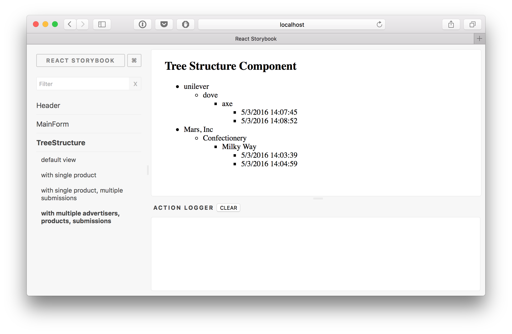

# react-redux-material-ui-form-experiment


## Package installation
```bash
$ npm install
```

## Use development server

```bash
$ npm start
```

open your browser at http://localhost:8080/

## Build assets
To put compiled files into `static` directory, type the following command.

```bash
$ npm run build
```


## Mocha tests
To test the react components, reducers and actions, type the following command

```bash
$ npm test
```

or

```bash
$ npm run test: watch
```

## Eslint
To use eslint, type the following command

```bash
$ npm run lint
```

## Use React Storybook to test the components
To test the react components using React Storybook, type the following command.

```bash
$ npm run storybook
```

open your browser at http://localhost:9001/



